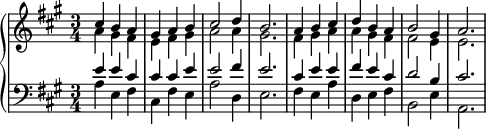

# 0. 和声レッスン 準備

## 前提知識

* 大譜表（ピアノ曲で使われるト音記号とヘ音記号が使われる二段の楽譜）と鍵盤上の音の対応が分かること
* #, b3つまでの長調・短調の構成音が分かること

大譜表が読めるかどうかの確認は、次の楽譜を参考にしてください

(どんなに時間をかけても良いので、ゆっくりと間違えずに鍵盤で弾ければ良い。また、同時に和音を弾くのが難しければ、1旋律ずつ弾ければまずは良い。)

