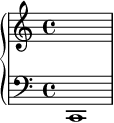
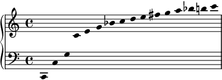

# 1. 倍音〜和音の機能

## やる内容

* 序 (p8)
* 第1章 倍音
* 第2章 自然協和音と自然不協和音
* 第3章 和声学習の予備的知識
* 第4章 数字付き低音
* 第5章 和音の機能 のうちp28-29の部分

## 序

* かなり発展的な内容なので、現段階では理解しなくて問題ない。
* 非常に簡単に要約すると、この本で扱う和声はJ.S.バッハ以降の音楽理論家ラモーや、古典派の作曲家、ロマン派以降のワーグナー・フォーレの間の時代に完成されたものである。

## 第1章 倍音

### 倍音列

p9上部の倍音の譜例は、楽音と倍音を少し区別しづらい。

次の楽音があったとき、

次の倍音が生じるということである。

倍音列の最低音を *基音* と呼ぶ。

### 和声の発展

中世から現代に至るまでの和声の発展と倍音列との関係は興味深いが、発展的な内容なので今回は扱わない。

## 第2章 自然協和音と自然不協和音

省略

## 第3章 和声学習の予備的知識

音階構成音の名称のうち、 *主音*, *下属音*, **
